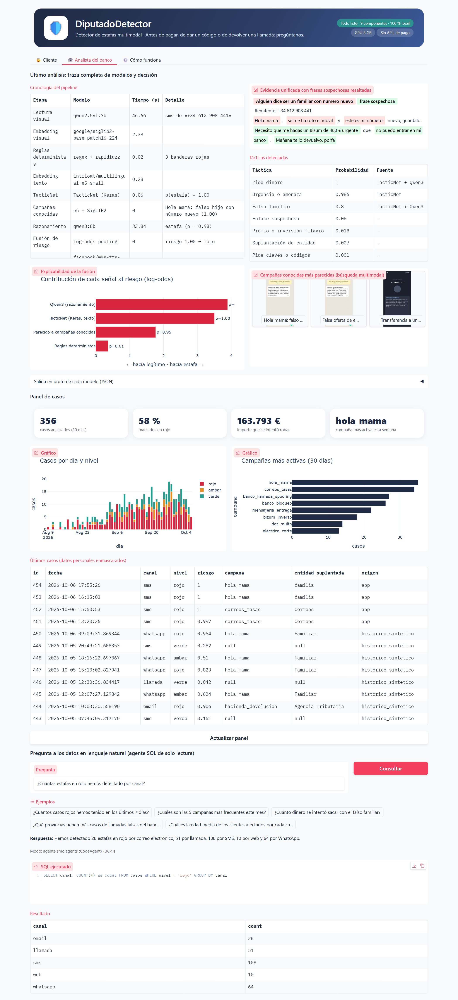
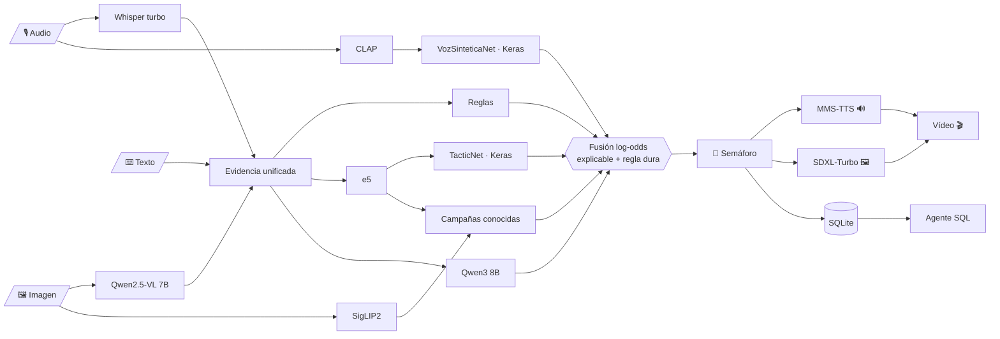

<div align="center">

# 🛡️ DiputadoDetector

### Detector de estafas multimodal

**Antes de pagar, de dar un código o de devolver una llamada: pregúntanos.**

Escudo antifraude B2B2C que el banco integra en su app. Analiza **llamadas, capturas de SMS y WhatsApp, cartas y
texto**, y responde con un **semáforo explicable**, un **aviso por voz**, una **infografía** y un **vídeo-alerta** para
la familia. **12 modelos coordinados, 2 entrenados por nosotros en Keras, 100 % local y sin APIs de pago.**


</div>

---

## Índice

1. [El problema y nuestra propuesta](#1-el-problema-y-nuestra-propuesta)
2. [Instalación en un clic](#2-instalación-en-un-clic)
3. [Qué se puede hacer](#3-qué-se-puede-hacer)
4. [Arquitectura](#4-arquitectura)
5. [Modelos y por qué los elegimos](#5-modelos-y-por-qué-los-elegimos)
6. [Resultados](#6-resultados)
7. [Notebooks](#7-notebooks)
8. [Viabilidad: negocio, costes y regulación](#8-viabilidad-negocio-costes-y-regulación)
9. [Limitaciones, ética y hoja de ruta](#9-limitaciones-ética-y-hoja-de-ruta)
10. [Solución de problemas](#10-solución-de-problemas)
11. [Estructura del repositorio](#11-estructura-del-repositorio)

---

## 1. El problema y nuestra propuesta

El fraude por **suplantación** (el falso empleado del banco que pide el código SMS, el SMS de Correos con una tasa de
1,99 €, el «hola mamá, este es mi número nuevo», las inversiones milagro en cripto) tiene tres rasgos:

* **Es multimodal.** La misma campaña llega por voz, por imagen y por texto. Un filtro que solo lee texto no oye una
  llamada; uno que solo escucha no ve el enlace del SMS.
* **Ataca a la persona, no al sistema.** Es la propia víctima quien autoriza la transferencia o dicta el código, así
  que los controles técnicos del banco no bastan.
* **Se ceba con los más vulnerables**, en especial personas mayores, que necesitan una respuesta clara y en voz alta.

Además, el nuevo Reglamento europeo de Servicios de Pago (PSR) traslada a los bancos parte del coste de reembolsar
el fraude por suplantación: **el banco tiene un incentivo directo para prevenirlo**.

| | Nuestra respuesta |
|---|---|
| **Cliente (paga)** | El banco, que integra DiputadoDetector en su app o lo despliega en sus servidores (B2B2C) |
| **Usuario** | Sus clientes, especialmente mayores de 60 años; y el equipo de fraude del banco (vista Analista) |
| **Propuesta de valor** | Un veredicto explicable en segundos para **cualquier** modalidad, con salida por voz, sin que ningún dato salga del banco |
| **Diferencial** | La multimodalidad mejora la detección (lo medimos en el [notebook 05](notebooks/05_orquestacion_y_ablacion.ipynb)) y la ejecución 100 % local resuelve la privacidad (RGPD) y la dependencia de terceros (DORA) con un coste marginal casi nulo |

## 2. Instalación en un clic

**Requisitos:** Windows 10/11 con una GPU NVIDIA de 8 GB o más (recomendado) y unos 30 GB libres. Sin GPU también
funciona, en *modo ligero* (más lento y sin ilustraciones generadas). También hay un script para macOS y Linux.

1. Descarga el repositorio (botón verde **Code → Download ZIP**) y descomprímelo, o clónalo:
   `git clone https://github.com/ALBERELVIS/Taller-Multimodales.git`
2. Haz **doble clic en `INSTALAR_Y_ARRANCAR.bat`**. La primera vez:
   * instala `uv` y un Python 3.12 oficial **dentro de la carpeta** (no toca tu sistema);
   * instala las librerías exactas de `uv.lock`;
   * comprueba tu equipo (GPU, disco, puertos) con mensajes claros;
   * descarga los modelos a `./models` (unos 25 GB; si se corta, vuelve a ejecutarlo y continúa donde lo dejó);
   * arranca una instancia propia de Ollama en el puerto 11435 y abre el navegador.
3. Las siguientes veces, **doble clic en `ARRANCAR.bat`**. Funciona **sin internet**.

La aplicación se abre en <http://127.0.0.1:7860>. La cabecera indica cuándo están listos todos los componentes.

<details>
<summary>Instalación manual (para desarrolladores)</summary>

```bash
# con uv (recomendado; reproduce exactamente uv.lock)
uv sync --frozen
uv run python scripts/download_models.py      # --light sin GPU
uv run python scripts/build_index.py
uv run python -m app.main

# o con pip y Python 3.12
python -m venv .venv
.venv/Scripts/python -m pip install -r requirements.txt   # incluye el índice de PyTorch cu128
```

macOS/Linux: `./instalar_y_arrancar.sh`. Pruebas: `python -m pytest` y `python scripts/smoke_test.py`.
</details>

## 3. Qué se puede hacer

### Vista Cliente

| Entrada | Ejemplo | Lo que ocurre |
|---|---|---|
| 📞 **¿Me están llamando?** | Graba la llamada con el altavoz o sube el audio | Whisper transcribe, CLAP y VozSinteticaNet analizan la voz, Qwen3 razona |
| 💬 **¿Es fiable este mensaje?** | Captura de SMS, WhatsApp, correo o foto de una carta, o texto pegado | Qwen2.5-VL lee la imagen, las reglas analizan enlaces e IBAN, SigLIP2 busca campañas conocidas |
| 🙋 **Pregúntame** | «¿Es normal que mi banco me pida el PIN?» (hablando o escribiendo) | Whisper → Qwen3 → respuesta hablada |

La respuesta llega **por etapas**: primero el semáforo y la explicación; después el aviso por voz, la infografía
(SDXL-Turbo con control de calidad SigLIP2) y el vídeo-alerta, con un botón para compartirlo con la familia.

Hay **5 casos de demostración** precargados: la llamada del falso banco (voz sintética de Bark por canal
telefónico), el SMS de Correos, el WhatsApp de «hola mamá», un SMS **legítimo** del banco (debe salir verde) y la
carta de una «gestora» de cripto.

### Vista Analista del banco



* **Cronología del pipeline**: cada modelo con su latencia y resultado (traza auditable).
* **Explicabilidad**: contribución de cada señal al riesgo final.
* Frases sospechosas **resaltadas** por táctica y **galería de campañas** parecidas (búsqueda multimodal).
* Panel de casos con KPIs y gráficos, y **preguntas en lenguaje natural** («¿cuántos casos rojos esta semana?»)
  resueltas por un agente SQL de solo lectura (smolagents + Qwen2.5 7B).

## 4. Arquitectura

Separación limpia en tres capas: **interfaz** (`app/`), **lógica de negocio** (`src/diputado/core/`) y **conectores a
modelos** (`src/diputado/ai/`). Detalles en [docs/arquitectura.md](docs/arquitectura.md).



Decisiones clave:

* **Grafo determinista, no agente**, para decidir el riesgo: mismos pasos siempre, reproducible y auditable. El
  agente se reserva para explorar datos.
* **Gestor de VRAM**: en 8 GB los modelos grandes se turnan la GPU y los pequeños viven en CPU. Es lo que permite
  ejecutar 12 modelos en un portátil.
* **Fusión log-odds**: `riesgo = σ(b + Σ wᵢ·logit(pᵢ))`. Cada término es la contribución visible de una señal; las
  señales de audio solo pueden subir el riesgo; pedir un código o instalar AnyDesk fuerza el rojo.
* **Ollama propio** en el puerto 11435 con los modelos en `./models`: todo contenido en el repositorio.

## 5. Modelos y por qué los elegimos

| Modelo | Función | Por qué (experimento) |
|---|---|---|
| `openai/whisper-large-v3-turbo` | Transcripción | Un 25 % menos de errores que `whisper-base` (WER 0,26 frente a 0,35) y 4 veces más rápido que el tiempo real ([nb 04](notebooks/04_seleccion_de_modelos.ipynb)); `whisper-base` en CPU como modo ligero |
| `qwen2.5vl:7b` (Ollama) | Lectura de capturas y cartas (JSON) | CER de 0,015 en nuestras capturas: copia exacta de dominios y enlaces, que deciden el veredicto; comparado con el 3B ([nb 04](notebooks/04_seleccion_de_modelos.ipynb)) |
| `qwen3:8b` (Ollama) | Razonamiento, veredicto y explicación (JSON) | F1 0,94 en nuestro test manual frente a 0,83 de Qwen2.5 7B, con unos 10 s por mensaje sin modo *thinking* ([nb 02](notebooks/02_keras_tacticnet.ipynb), [04](notebooks/04_seleccion_de_modelos.ipynb)) |
| `qwen2.5:7b` + smolagents | Agente SQL del analista | Fiable escribiendo código y SQL; un modelo distinto al del veredicto |
| `intfloat/multilingual-e5-small` | Embeddings de texto | Multilingüe, 384 dimensiones, milisegundos en CPU |
| `google/siglip2-base-patch16-224` | Búsqueda visual de campañas e IQA | Recall@3 de 0,82 frente a 0,35 de CLIP al buscar la campaña de una captura; puntuaciones absolutas útiles como control de calidad ([nb 04](notebooks/04_seleccion_de_modelos.ipynb)) |
| `laion/clap-htsat-unfused` | Contexto acústico y embeddings de voz | Clasificación sin entrenamiento y base para VozSinteticaNet |
| **TacticNet** (Keras, propio) | Estafa + 7 tácticas desde e5 | Rápido, calibrado y explicable ([nb 02](notebooks/02_keras_tacticnet.ipynb)) |
| **VozSinteticaNet** (Keras, propio) | ¿Voz humana o sintética? | Validación dejando fuera un generador ([nb 03](notebooks/03_keras_voz_sintetica.ipynb)); experimental |
| `facebook/mms-tts-spa` | Aviso por voz | Igual de inteligible que Bark y unas 25 veces más rápido, en CPU y determinista ([nb 04](notebooks/04_seleccion_de_modelos.ipynb)) |
| `stabilityai/sdxl-turbo` | Ilustración de la infografía | 2 pasos: casi la misma puntuación SigLIP2 que con 4; con 8 GB la latencia (~15 s) la domina mover el modelo entre RAM y VRAM, no los pasos ([nb 04](notebooks/04_seleccion_de_modelos.ipynb)) |
| `suno/bark-small` | Llamadas sintéticas (datos y demo) | Prosodia natural: el tipo de voz que queremos detectar |
| `openai/clip-vit-base-patch32`, `openai/whisper-base` | Solo como comparación | Referencias en el notebook 04 |

## 6. Resultados

<!-- RESULTADOS -->
*Las cifras se rellenan al ejecutar los notebooks; ver sección 7.*
<!-- /RESULTADOS -->

## 7. Notebooks

Cada decisión del proyecto está justificada con un experimento. Los notebooks importan el código de `src/` (no
duplican lógica) y están **ejecutados**, con sus salidas visibles en GitHub.

| Notebook | Contenido |
|---|---|
| [00 · Negocio y viabilidad](notebooks/00_negocio_y_viabilidad.ipynb) | Problema, lean canvas, B2B2C, coste por análisis local frente a APIs, monetización, regulación (RGPD, PSD3/PSR, AI Act, DORA) y riesgos |
| [01 · Datos sintéticos](notebooks/01_datos_sinteticos.ipynb) | Taxonomía de 7 tácticas, 1.032 mensajes generados con Qwen3, controles de calidad, capturas renderizadas, canal telefónico simulado, dataset de voz y fichas de datos |
| [02 · TacticNet (Keras)](notebooks/02_keras_tacticnet.ipynb) | Partición por grupos, referencias (reglas, TF-IDF, sonda lineal, Qwen3), pérdida enmascarada, 5 semillas, calibración por temperatura, análisis de errores |
| [03 · VozSinteticaNet (Keras)](notebooks/03_keras_voz_sintetica.ipynb) | CLAP congelado + red pequeña; dentro de distribución, dejando fuera un generador y efecto del canal telefónico |
| [04 · Selección de modelos](notebooks/04_seleccion_de_modelos.ipynb) | Whisper, VLM 7B frente a 3B, CLIP frente a SigLIP2, MMS frente a Bark, pasos de SDXL-Turbo, LLMs; calibración de la búsqueda de campañas |
| [05 · Orquestación y ablación](notebooks/05_orquestacion_y_ablacion.ipynb) | 61 casos multimodales, cada señal por separado frente a la fusión, bootstrap, ajuste de pesos (`artifacts/fusion.json`) |
| [06 · Latencia, VRAM y costes](notebooks/06_latencia_vram_costes.ipynb) | Latencia de cada flujo, VRAM en el tiempo, energía y coste por análisis |

Para abrirlos: `.venv\Scripts\python -m jupyter lab` (en Windows con *Smart App Control*, usa siempre
`python -m ...` en lugar de `jupyter.exe`).

## 8. Viabilidad: negocio, costes y regulación

* **Monetización:** licencia SaaS al banco por usuario activo al mes, más tarifa de despliegue en sus servidores y un
  módulo de inteligencia de campañas. El precio se ancla al fraude evitado.
* **Costes:** con modelos locales, el coste marginal por análisis es la electricidad (milésimas de euro, medido en el
  [notebook 06](notebooks/06_latencia_vram_costes.ipynb)); con APIs de pago equivalentes sería del orden de céntimos
  y obligaría a enviar audio y capturas de clientes a terceros ([notebook 00](notebooks/00_negocio_y_viabilidad.ipynb)).
* **Regulación:**
  * **RGPD:** procesamiento local y datos personales enmascarados antes de guardar.
  * **AI Act:** la detección de fraude financiero está excluida del anexo III de alto riesgo; aun así cumplimos la
    transparencia del artículo 50 marcando todo lo generado como «Generado por IA».
  * **PSD3/PSR:** reforzamos el momento crítico, antes de dictar un OTP.
  * **DORA:** sin proveedores críticos externos.
* **Diseño responsable:** el sistema **aconseja, no bloquea**; la decisión es siempre de la persona.

Pitch deck técnico: [docs/pitch_deck.md](docs/pitch_deck.md) (diapositivas Marp; exportable a PDF con
`npx @marp-team/marp-cli docs/pitch_deck.md --pdf`). Guion de la demo: [docs/guion_demo.md](docs/guion_demo.md).

## 9. Limitaciones, ética y hoja de ruta

**Limitaciones que declaramos:**

* TacticNet se entrena con datos **sintéticos** (estilo de un único LLM). Lo mitigamos con negativos difíciles,
  partición por grupos y un test escrito a mano, pero en producción habría que reentrenar con casos reales
  etiquetados por el banco.
* VozSinteticaNet es **experimental**: solo dos sintetizadores y voz leída. Por eso en la fusión solo puede subir el
  riesgo.
* El test manual (61 casos) es pequeño: los intervalos de confianza son amplios y los reportamos.
* En 8 GB de VRAM los modelos grandes se turnan; en un servidor con 24 GB todo quedaría cargado y la latencia bajaría.

**Ética:**

* Generar ejemplos de estafa es un uso dual. Usamos marcas ficticias, enlaces no funcionales y solo los usamos para
  entrenar un detector.
* No usamos logotipos reales ni datos de clientes reales.
* Las voces sintéticas de la demo están marcadas como tales.

**Hoja de ruta:**

1. Piloto con un banco y una asociación de mayores.
2. Aprendizaje continuo con los casos confirmados por el equipo de fraude.
3. Ampliar la base de campañas con fuentes públicas (INCIBE, Policía Nacional).
4. Extensión de navegador y análisis en tiempo real de llamadas (con consentimiento).
5. Detector de voz clonada entrenado con más sintetizadores.

## 10. Solución de problemas

| Síntoma | Causa probable | Solución |
|---|---|---|
| «Una directiva de control de aplicaciones bloqueó este archivo» | **Smart App Control** de Windows 11 bloquea ejecutables y DLL sin firma reconocida | El launcher ya lo evita: usa un Python 3.12 **firmado** y fija versiones compatibles (`pyarrow<25`, sin `numba`). Si ocurre con un `.exe` de `.venv\Scripts`, usa `python -m <módulo>` |
| La primera importación tarda minutos | Windows Defender analiza las librerías nuevas | Solo ocurre la primera vez |
| «No he podido arrancar Ollama» | Puerto 11435 ocupado o descarga interrumpida | Cierra otras instancias y vuelve a ejecutar `INSTALAR_Y_ARRANCAR.bat` |
| Sin GPU o con menos de 8 GB | | Modo ligero automático: Whisper base en CPU e infografía de plantilla |
| La interfaz se ve oscura | Tema del sistema | La aplicación fuerza el modo claro (`?__theme=light`) |
| Tildes raras en la consola | Página de códigos de la consola | Los `.bat` ya activan UTF-8 (`chcp 65001`, `PYTHONUTF8=1`) |
| La descarga de modelos se cortó | Conexión | Vuelve a ejecutar: continúa donde lo dejó |

Comprobación rápida del sistema: `.venv\Scripts\python scripts\check_system.py`.

## 11. Estructura del repositorio

```text
app/                  interfaz Gradio: main.py, ui_cliente.py, ui_analista.py, ui_info.py, services.py, theme.css
src/diputado/
  config.py           marca, rutas, modelos, umbrales y tácticas (un único sitio)
  ai/                 conectores a modelos y gestor de VRAM
  core/               orquestador, reglas, campañas, fusión, base de casos y agente SQL
  media/              capturas sintéticas, infografía y vídeo
  data/               generación de datos (texto, voz, canal telefónico, casos de demo)
artifacts/            modelos Keras, pesos de la fusión y resultados de los notebooks
data/                 campañas, casos de demo, test manual y datos sintéticos
notebooks/            00 a 06
scripts/              check_system, download_models, build_index, smoke_test, capturas (imágenes de docs/img),
                      actualizar_resultados (sección 6 del README y métricas del pitch deck), get_python.ps1
tests/                pruebas unitarias (pytest)
docs/                 arquitectura, pitch deck, guion de la demo e imágenes
INSTALAR_Y_ARRANCAR.bat · ARRANCAR.bat · instalar_y_arrancar.sh · pyproject.toml · uv.lock · requirements.txt
```

La marca y el subtítulo se cambian en un único sitio: `BRAND_NAME` y `BRAND_TAGLINE` en
[`src/diputado/config.py`](src/diputado/config.py).

---

<div align="center">
<sub>Proyecto académico · Taller B5-T4 «Diseño y prototipado de una startup FinTech basada en IA multimodal» · Todo el contenido generado por la aplicación está marcado como «Generado por IA».</sub>
</div>
