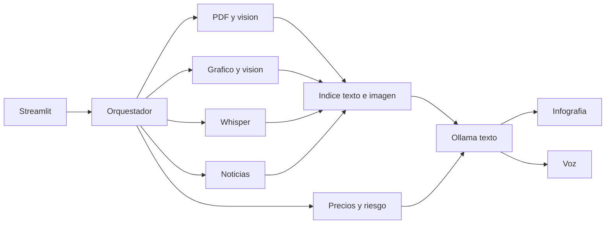
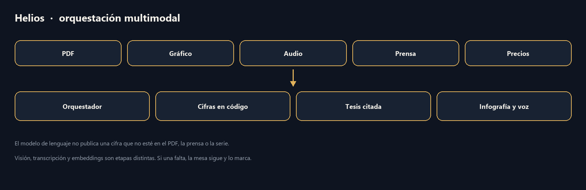
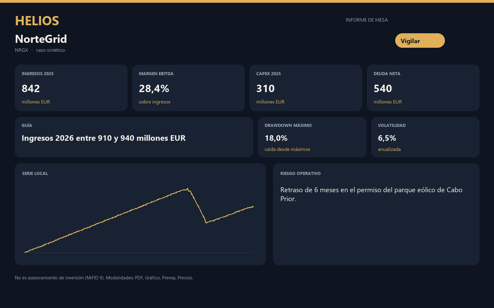
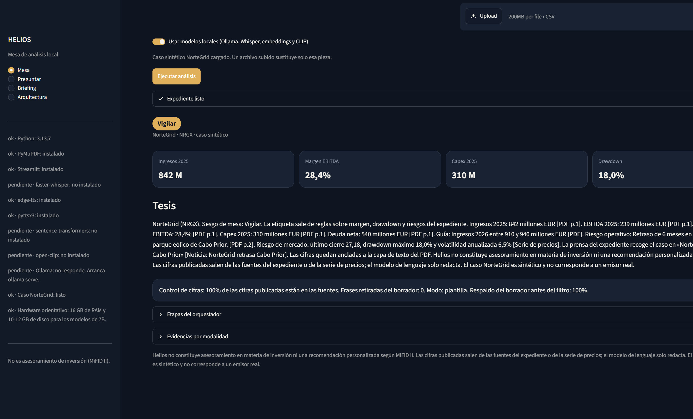
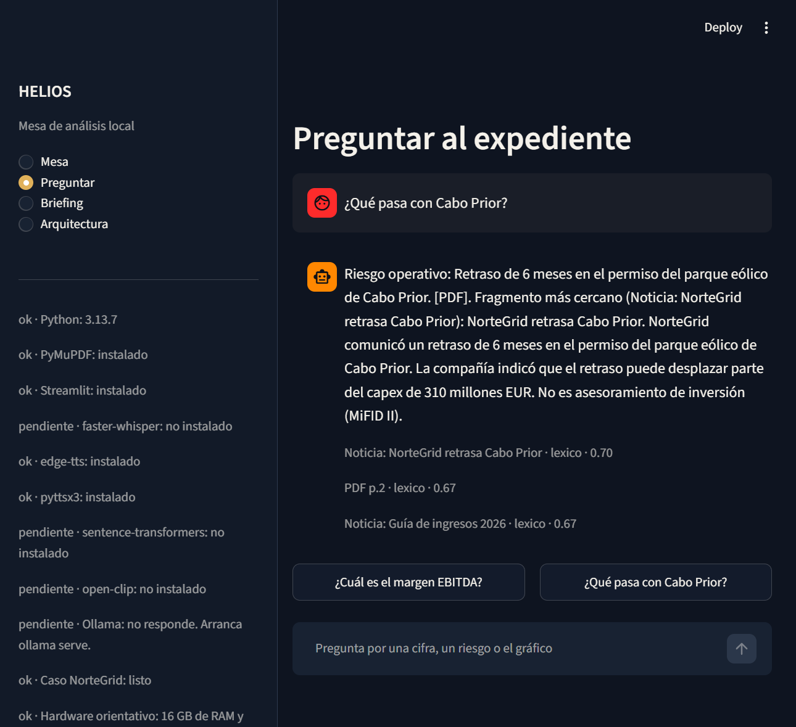
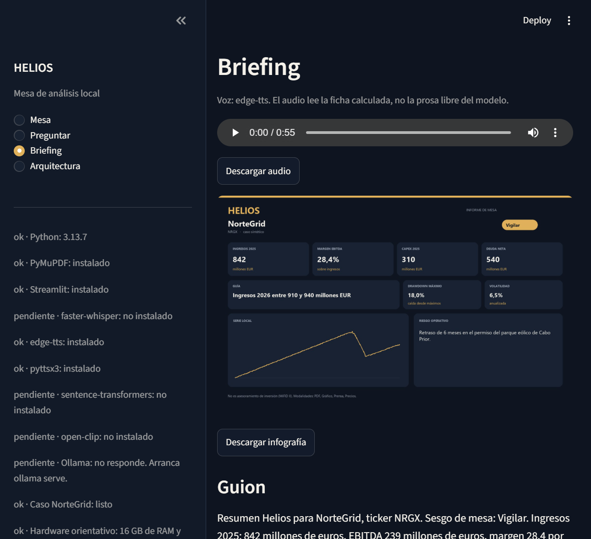

# Helios

Mesa de análisis de inversión para gestores independientes y family offices pequeños. El expediente de una compañía llega partido en PDF, gráfico, audio, prensa y precios. Helios cruza esas modalidades y publica una nota en la que **cada cifra sale del documento o de la serie**, no de la imaginación del modelo.

El caso que arranca con un clic, NorteGrid (NRGX), es sintético. Sirve para demostrar el producto y para medir si el sistema acierta.

## Arranque en Windows

Hace falta Python 3.10 o superior y [Ollama](https://ollama.com) si quieres visión y redacción con modelo local. Sin Ollama la mesa abre igual: calcula el riesgo, extrae el PDF y redacta con la plantilla de control.

```powershell
powershell -ExecutionPolicy Bypass -File scripts\run.ps1
```

El script crea `.venv`, instala `requirements.txt`, genera el caso demo, arranca Ollama si el binario está instalado, descarga los modelos que falten y abre la aplicación en el navegador.

Si el PC va justo, copia `.env.example` a `.env` y baja el modelo de texto a `qwen2.5:3b`. Reserva unos 10-12 GB de disco y 16 GB de RAM para los modelos de 7B. La primera visión en CPU puede tardar uno o dos minutos; las siguientes usan la caché de `data/cache`.

Atajos:

```powershell
powershell -ExecutionPolicy Bypass -File scripts\run.ps1 -SkipInstall
powershell -ExecutionPolicy Bypass -File scripts\run.ps1 -SkipModels
```

## Arranque en Linux o macOS

```bash
bash scripts/run.sh
```

## Docker

```bash
docker compose up --build
```

La app queda en `http://localhost:8501`. El servicio `ollama-pull` descarga `qwen2.5:7b` y un modelo de visión la primera vez. Hasta que termine, la mesa trabaja con la plantilla y el cálculo local.

## Qué hacer en la demo

1. Pulsa **Cargar caso demo NorteGrid**.
2. Pulsa **Ejecutar análisis**.
3. Recorre las etapas: PDF, visión, precios, gráfico, transcripción, prensa, índice, tesis, control de cifras, infografía y voz.
4. En **Preguntar**, prueba «¿Qué pasa con el permiso de Cabo Prior?» o «¿Cuál es el drawdown de la serie?».
5. En **Briefing**, escucha el audio y descarga la infografía.
6. En **Arquitectura**, mira el coste de esa ejecución.

También puedes subir tu propio PDF, gráfico, audio, noticias o CSV. Con la casilla de precios en vivo, la serie sale de Yahoo Finance si hay red.

## Propuesta de valor

| | |
| --- | --- |
| Cliente | Gestor independiente o family office pequeño (B2B) |
| Dolor | El expediente está partido en formatos que no se leen juntos |
| Diferencia | Cada modalidad aporta una evidencia y la nota cita la fuente |
| Por qué local | El audio y el PDF no se envían a una API de pago |
| Ingreso | Suscripción por puesto. El coste marginal de un análisis es electricidad, no una factura por token |

Un análisis en esta máquina, a 65 W y 0,18 EUR/kWh, cuesta fracciones de céntimo. El mismo encadenado en una API de pago se estima en la ficha de arquitectura. Esas tarifas son una hipótesis de trabajo para comparar, no un contrato.

Presupuesto de latencia para que la mesa se sienta usable:

- Lectura del PDF: menos de 2 s
- Visión, por imagen, en CPU: 15 a 90 s
- Whisper `small` sobre un minuto de audio: 20 a 60 s
- Tesis: 20 a 60 s
- Infografía: menos de 2 s
- Voz: 2 a 20 s

## Modalidades y modelos

| Modalidad | Pieza | Por defecto |
| --- | --- | --- |
| Texto | Ollama | `qwen2.5:7b`, y si no está, `qwen2.5:3b` o `llama3.2:3b` |
| Visión del PDF y del gráfico | Ollama | `qwen2.5vl:7b`, luego `llava:7b`, luego `moondream` |
| Voz a texto | faster-whisper | `small`, en CPU, int8 |
| Texto a voz | edge-tts | `es-ES-ElviraNeural`, sin clave. Si no hay red, la voz del sistema |
| Texto a imagen | Código (PIL) | Infografía con las cifras de la ficha |
| Búsqueda cruzada | sentence-transformers y CLIP | `all-MiniLM-L6-v2` y `ViT-B-32`. Si no están, búsqueda por palabras |

La infografía no la dibuja un modelo generativo. Una lámina de riesgo tiene que ser fiel: si el drawdown es el 18%, el 18% lo calcula la serie.

## Arquitectura





La pantalla no llama a un modelo. Llama a `run_analysis`.

- `src/helios/models/`: Ollama, Whisper, voz, embeddings y CLIP
- `src/helios/ingest/` y `src/helios/analysis/`: PDF, precios, riesgo, citas, tesis y preguntas
- `src/helios/orchestration/pipeline.py`: ordena las etapas y retira las frases con cifras que no están en las fuentes
- `app/`: solo interfaz
- `notebooks/`: importan el mismo paquete

Regla de cifras: se pueden publicar números del texto del PDF, de la prensa y de la serie. Una cifra que solo aparece en la prosa del modelo de visión o del modelo de lenguaje se retira. El sesgo de mesa (Vigilar, Constructivo, Defensivo, Neutral) lo deciden reglas sobre margen, drawdown y riesgo. El modelo redacta; no cambia la etiqueta.

## Caso NorteGrid

`scripts/build_demo_case.py` deja en `data/samples/nortegrid/` el PDF, las velas, el guion, el audio, las noticias y `verdad.json`. Los ingresos son 842 millones EUR, el margen EBITDA 28,4%, el capex 310, la deuda neta 540, la guía 910-940 y el riesgo es un retraso de 6 meses en el permiso de Cabo Prior. La serie cae un 18% a propósito.

Los cuadernos miden ese caso:

- `notebooks/01_caso_y_datos.ipynb`
- `notebooks/02_modalidades.ipynb`
- `notebooks/03_orquestacion.ipynb`
- `notebooks/04_evaluacion.ipynb`

Pruebas sin modelos, desde la raíz del repo:

```powershell
$env:PYTHONPATH = "src"
.\.venv\Scripts\python -m pytest
```

## Cumplimiento

Helios no es asesoramiento de inversión ni una recomendación personalizada según MiFID II. El aviso va en la tesis, en la infografía y en el audio.

El PDF, el gráfico, la transcripción y el razonamiento se quedan en el ordenador. Eso es lo que se puede prometer a un cliente regulado. La locución con edge-tts envía solo el guion ya redactado a un servicio de voz gratuito, sin clave de API. Quien necesite que tampoco salga el audio pone en `.env`:

```
HELIOS_TTS=system
```

o `HELIOS_TTS=off` para dejar únicamente el guion escrito.

## Capturas

Tras el primer análisis, la infografía queda en `data/output/NRGX/infografia.png`. El diagrama de arriba se genera con el caso demo.









## Estructura

```
app/                  interfaz Streamlit
src/helios/           dominio, modelos y orquestación
notebooks/            caso, modalidades, orquestación y evaluación
scripts/              arranque, caso demo y descarga de modelos
data/samples/         expediente sintético
tests/                riesgo, citas, router, extractor y mesa
docs/PITCH.md         pitch técnico
```

## Equipo

Completar con los tres integrantes del grupo.

## Límites

El extractor estructurado reconoce las etiquetas del informe demo (ingresos, EBITDA, margen, capex, deuda, guía y riesgo). Un PDF con otra maquetación se lee igual como texto y como imagen, pero no rellena esas casillas hasta que el texto contiene las etiquetas. La visión no manda en las cifras cuando el PDF tiene capa de texto. NorteGrid no es un emisor real.
