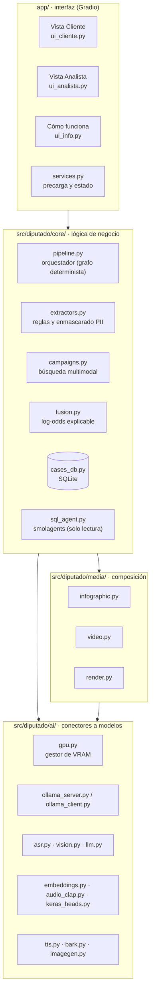
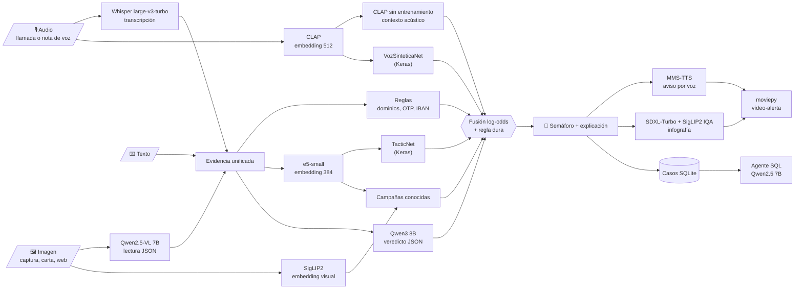

# Arquitectura de DiputadoDetector

Este documento describe cómo está construido DiputadoDetector: las tres capas del código, el flujo de datos
multimodal, la política de VRAM, la fusión explicable y las decisiones de seguridad. Los experimentos que
justifican cada elección están en [`notebooks/`](../notebooks).

## 1. Tres capas separadas



* **`app/`** solo sabe de componentes visuales y eventos: no importa ningún modelo directamente.
* **`src/diputado/core/`** contiene las reglas de negocio (qué se analiza, en qué orden, cómo se decide y qué
  se guarda). No sabe de Gradio y se usa igual desde los notebooks y los tests.
* **`src/diputado/ai/`** encapsula cada modelo detrás de una función simple (`transcribe`, `read_image`,
  `analyze`, `embed_text`...) que devuelve `(resultado, métricas)`. Cambiar un modelo es cambiar un
  identificador en [`config.py`](../src/diputado/config.py).
* **`src/diputado/media/`** maqueta las salidas (infografía, vídeo y capturas sintéticas).

## 2. Flujo de datos multimodal



El orquestador ([`pipeline.py`](../src/diputado/core/pipeline.py)) es un **generador**: tras cada etapa
devuelve el resultado parcial y la interfaz se actualiza. El usuario ve el progreso («Escuchando la
llamada», «Leyendo la imagen»...), recibe el semáforo en segundos y después, de forma progresiva, la voz,
la infografía y el vídeo.

### ¿Por qué un grafo determinista y no un agente?

En un contexto regulado necesitamos que cada análisis siga **siempre los mismos pasos**, sea reproducible
y deje una traza auditable (la «Cronología del pipeline» de la vista Analista). Un agente autónomo que
decide qué herramientas usar añade latencia, variabilidad y riesgo de saltarse un control. Reservamos el
agente (smolagents) para la **exploración de datos del analista**, donde la flexibilidad aporta más que la
predictibilidad, y aun así lo encerramos en una conexión de solo lectura.

## 3. Gestor de VRAM

Con 8 GB no caben a la vez Qwen2.5-VL (≈ 6 GB), Qwen3 (≈ 6 GB), Whisper turbo (≈ 1,6 GB) y SDXL-Turbo.
[`gpu.py`](../src/diputado/ai/gpu.py) aplica esta política:

| Modelo | Dónde vive | Por qué |
|---|---|---|
| e5, SigLIP2, CLAP, MMS-TTS, TacticNet, VozSinteticaNet | CPU, siempre cargados | Milisegundos en un Ryzen moderno; no compiten por VRAM |
| Whisper turbo | GPU bajo demanda; se mueve a RAM al ceder la GPU | Volver a la GPU tarda < 1 s |
| Qwen2.5-VL, Qwen3, Qwen2.5 (Ollama) | GPU, un modelo cada vez (`OLLAMA_MAX_LOADED_MODELS=1`) | Se descargan con `keep_alive=0` al ceder la GPU; cambiar de uno a otro cuesta entre 20 y 30 s de carga |
| SDXL-Turbo | GPU con `enable_model_cpu_offload` | Pico contenido; se libera al terminar |
| Bark | GPU (solo para generar datos y la demo) | No forma parte del flujo del cliente |

`gpu.claim(dueño)` es un cerrojo reentrante que desaloja al ocupante anterior antes de dar la GPU al nuevo.
Sin GPU (o con menos de 7,5 GB) el sistema entra en **modo ligero**: Whisper base en CPU e infografía de
plantilla sin SDXL.

### Ollama propio

El launcher arranca una instancia de Ollama **dedicada** en el puerto 11435 con
`OLLAMA_MODELS=./models/ollama`, de modo que todo queda dentro del repositorio y no interfiere con otra
instalación de Ollama del usuario (puerto 11434). Ver [`ollama_server.py`](../src/diputado/ai/ollama_server.py).

**Un problema real de VRAM que encontramos y cómo lo resolvimos.** Al medir la ablación (notebook 05) cada
captura tardaba unos 120 s, cuando en el notebook 04 el modelo de visión leía una imagen en 7 s. El registro de
Ollama (`logs/ollama.log`) mostraba la causa:

1. En este portátil (AMD + NVIDIA), el descubrimiento de GPU de Ollama 0.35 tarda más que su propio límite de
   tiempo y avisa con «unable to refresh free memory, using old values».
2. El valor antiguo es la VRAM libre **con el modelo anterior todavía cargado**: tras usar Qwen3 cree que
   quedan 1,1 GB, aunque Qwen3 ya se ha descargado.
3. Con esa cifra, Ollama carga Qwen2.5-VL a medias y deja su codificador de imagen en CPU («CLIP using CPU
   backend»): unos 140 s por captura.

Lo resolvimos con dos cambios. Desactivamos la exploración de la iGPU por Vulkan (`OLLAMA_VULKAN=0`), que
alargaba el arranque de Ollama de 10 s a 90 s. Y antes de un modelo de visión cargamos `all-minilm`, un modelo
de 46 MB (`ollama_client.prime_vram`): la medida «antigua» pasa a ser la buena (6,9 GB libres) y Qwen2.5-VL
entra entero en la GPU con su codificador. La lectura de una captura, cambio de modelo incluido, bajó de unos
140 s a unos 40 s.

## 4. Fusión explicable

[`fusion.py`](../src/diputado/core/fusion.py) combina las señales con *log-odds pooling*:

$$\text{riesgo} = \sigma\Big(b + \sum_i w_i \cdot \operatorname{logit}(p_i)\Big)$$

* Una señal ausente vale `p = 0,5` (logit 0) y no aporta nada.
* Cada término `w_i · logit(p_i)` es la **contribución** de esa señal, que la vista Analista muestra en un
  gráfico de barras.
* Las señales de audio (`voz`, `acustica`) son **amplificadoras**: se recortan a `p ≥ 0,5` antes del logit,
  así que solo pueden subir el riesgo.
* **Regla dura:** si se pide un código/PIN o instalar una app de control remoto y al menos un modelo
  coincide en que es sospechoso, el riesgo nunca baja de 0,9.
* Los pesos se ajustan en el notebook 05 (validación cruzada dejando uno fuera, pesos no negativos) y se
  guardan en [`artifacts/fusion.json`](../artifacts/fusion.json).
* Umbrales del semáforo: verde < 0,35 ≤ ámbar < 0,65 ≤ rojo.

## 5. Modelos Keras propios

| | TacticNet | VozSinteticaNet |
|---|---|---|
| Entrada | Embedding e5 (384) | Embedding CLAP (512) |
| Salida | `estafa` (1) y `tacticas` (7), sigmoides | `voz_sintetica` (1), sigmoide |
| Arquitectura | Tronco 256→128 GELU compartido + 2 cabezas; temperatura incorporada con `Rescaling` | 128→32 GELU, ruido gaussiano y *dropout* 0,4 |
| Datos | Sintético en español (Qwen3) + UCI SMS Spam (tácticas enmascaradas) | MLS español frente a MMS y Bark, tras canal telefónico |
| Notebook | [02](../notebooks/02_keras_tacticnet.ipynb) | [03](../notebooks/03_keras_voz_sintetica.ipynb) |
| Backend | Keras 3 con `KERAS_BACKEND=torch` | Ídem |

## 6. Seguridad y privacidad

* **Todo local:** ningún audio, imagen ni texto sale del equipo. No hay APIs de pago ni telemetría
  (`GRADIO_ANALYTICS_ENABLED=False`; con `DD_OFFLINE=1` también se bloquean las descargas de Hugging Face).
* **Agente SQL de solo lectura**, con triple defensa ([`cases_db.safe_query`](../src/diputado/core/cases_db.py)):
  1. lista negra de instrucciones (`INSERT`, `DROP`, `PRAGMA`, `ATTACH`...) y una única sentencia;
  2. conexión SQLite `mode=ro`;
  3. `PRAGMA query_only = ON`.
  Lo comprueban los tests de [`tests/test_sql_guard.py`](../tests/test_sql_guard.py).
* **Enmascarado de datos personales** antes de guardar: IBAN, tarjetas, DNI y teléfonos
  ([`extractors.mask_pii`](../src/diputado/core/extractors.py)).
* **Transparencia (AI Act, art. 50):** la infografía y el vídeo llevan la marca «Generado por IA».
* **El sistema aconseja, no bloquea:** no ejecuta acciones sobre la cuenta del cliente.

## 7. Estructura del repositorio

```text
app/                 interfaz Gradio (main.py, ui_cliente.py, ui_analista.py, ui_info.py, theme.css)
src/diputado/
  config.py          marca, rutas, modelos, umbrales y tácticas (un único sitio)
  ai/                conectores: gpu, ollama, asr, vision, llm, embeddings, audio_clap, keras_heads, tts, bark, imagegen
  core/              pipeline, extractors, campaigns, fusion, cases_db, sql_agent, schemas
  media/             render (capturas sintéticas), infographic, video, fonts
  data/              synth_text, voices, telephony, demo_cases
artifacts/           tacticnet.keras, voz_sintetica.keras, fusion.json y resultados de los notebooks
data/                campañas, casos de demo, test manual y datos sintéticos
notebooks/           00 a 06: negocio, datos, Keras, selección de modelos, ablación y rendimiento
scripts/             check_system, download_models, build_index, smoke_test, get_python.ps1
tests/               fusión, extractores y protección de solo lectura del agente SQL
docs/                arquitectura, pitch deck (Marp), guion de la demo e imágenes
INSTALAR_Y_ARRANCAR.bat · ARRANCAR.bat · instalar_y_arrancar.sh
```
