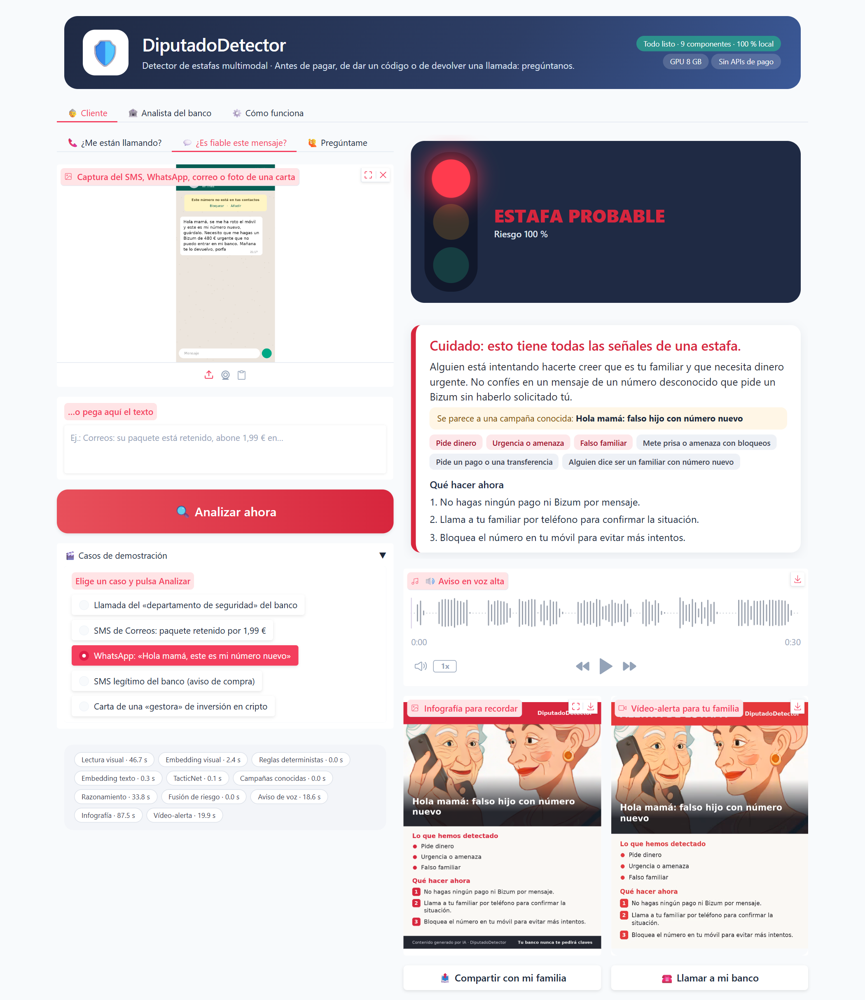
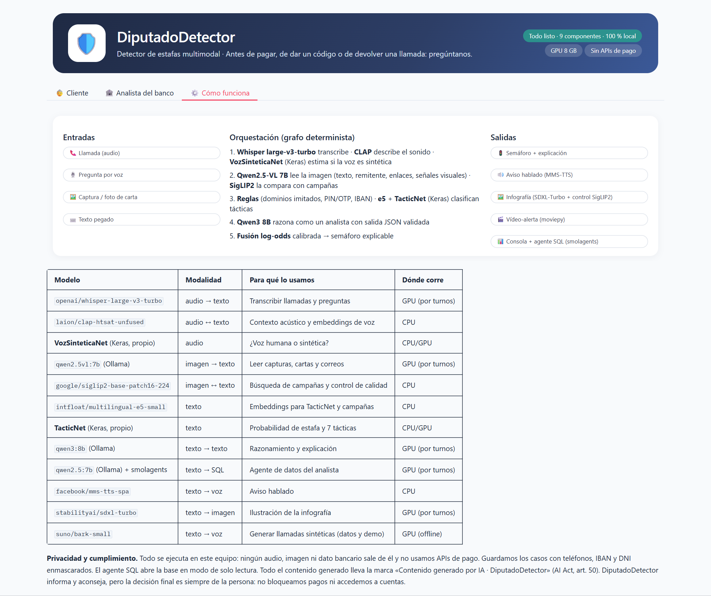

<!-- _class: lead -->

# 🛡️ DiputadoDetector

## Detector de estafas multimodal

**Antes de pagar, de dar un código o de devolver una llamada: pregúntanos.**

Taller B5-T4 · Startup FinTech basada en IA multimodal

---

## El problema

* La estafa por **suplantación** llega por **voz** (falso banco), **imagen** (SMS de Correos, carta) y **texto**
  («hola mamá»).
* Es la víctima quien **autoriza** el pago o dicta el código: los controles técnicos no bastan.
* Las personas **mayores** son las más afectadas y necesitan una respuesta clara y **en voz alta**.
* Con el nuevo **PSR** europeo, el banco asume parte del **reembolso**: tiene incentivo para prevenir.

Fraude en pagos en el EEE ≈ 4.300 M€/año (EBA-BCE, 2024) · ≈ 9 de cada 10 ciberdelitos en España son estafas (Interior, 2023)

---

## La solución

| Entrada | → | Salida |
|---|---|---|
| 📞 Llamada · 🖼️ Captura o carta · ⌨️ Texto · 🎙️ Pregunta | **12 modelos coordinados** | 🚦 Semáforo explicable · 🔊 Aviso por voz · 🖼️ Infografía · 🎬 Vídeo para la familia · 📊 Consola del banco |

* **B2B2C:** el banco lo integra en su app; el usuario es su cliente.
* **100 % local:** ningún dato sale del banco; **sin APIs de pago**.
* **Dos modelos propios en Keras:** TacticNet (tácticas) y VozSinteticaNet (voz sintética).

---

## Demo

---

## Arquitectura: tres capas

* `app/`: interfaz Gradio (Cliente, Analista y «Cómo funciona»).
* `src/diputado/core/`: orquestador determinista, reglas, campañas, **fusión explicable**, SQLite y agente SQL.
* `src/diputado/ai/`: conectores (Whisper, Qwen2.5-VL, Qwen3, e5, SigLIP2, CLAP, MMS, SDXL, Bark, Keras) y
  **gestor de VRAM**.

**Gestor de VRAM:** con 8 GB, los modelos grandes se turnan la GPU y los pequeños viven en CPU.

**Fusión:** `riesgo = σ(b + Σ wᵢ · logit(pᵢ))` → cada señal muestra su contribución; las de audio solo suben el
riesgo; pedir un código fuerza el rojo.

---

## Orquestación multimodal

---

## Ciencia detrás: lo medimos todo

<!-- METRICAS -->
| Experimento | Resultado |
|---|---|
| TacticNet frente a referencias (test manual) | ver notebook 02 |
| VozSinteticaNet dejando fuera un generador | ver notebook 03 |
| Ablación: señal individual frente a fusión | ver notebook 05 |
| Latencia del veredicto | ver notebook 06 |
<!-- /METRICAS -->

Datos de entrenamiento sintéticos y un test escrito a mano que nunca se usa para decidir nada.

---

## Viabilidad económica

* **Coste por análisis local:** electricidad, milésimas de euro (medido).
* **Con APIs de pago equivalentes:** del orden de céntimos, y enviando audio de clientes a terceros.
* **Monetización:** licencia SaaS por usuario activo al mes + despliegue en los servidores del banco + módulo de
  inteligencia de campañas.
* **Precio anclado al ahorro:** el banco paga una fracción del fraude que evita (y que con el PSR reembolsaría).

---

## Regulación y ética

| Norma | Cómo la abordamos |
|---|---|
| RGPD | Procesamiento local; IBAN, DNI, tarjetas y teléfonos enmascarados |
| AI Act | Fraude excluido del anexo III; marca «Generado por IA» (art. 50) |
| PSD3 / PSR | Protegemos el momento crítico: antes de dictar el OTP |
| DORA | Sin proveedores críticos externos; funciona sin internet |

**Aconsejamos, no bloqueamos:** la decisión es siempre de la persona.

---

## Limitaciones honestas y hoja de ruta

* Datos de entrenamiento **sintéticos** → piloto con casos reales del banco.
* VozSinteticaNet **experimental** (dos sintetizadores) → más generadores y voz clonada.
* Test manual pequeño → intervalos de confianza reportados.

**Siguientes pasos:** piloto con un banco y una asociación de mayores · aprendizaje continuo · base de campañas
pública (INCIBE) · análisis de llamadas en tiempo real.

---

<!-- _class: lead -->

# Gracias

**Instalación en un clic:** `INSTALAR_Y_ARRANCAR.bat`

Repositorio: github.com/ALBERELVIS/Taller-Multimodales
